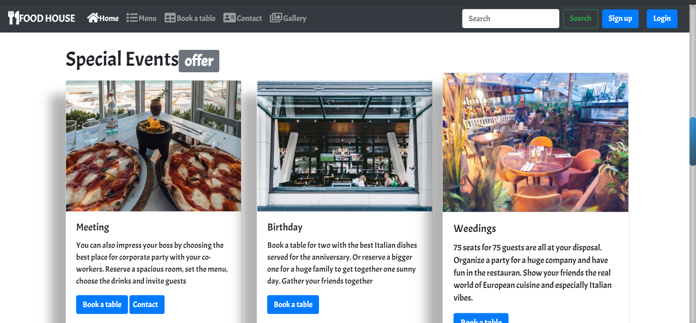
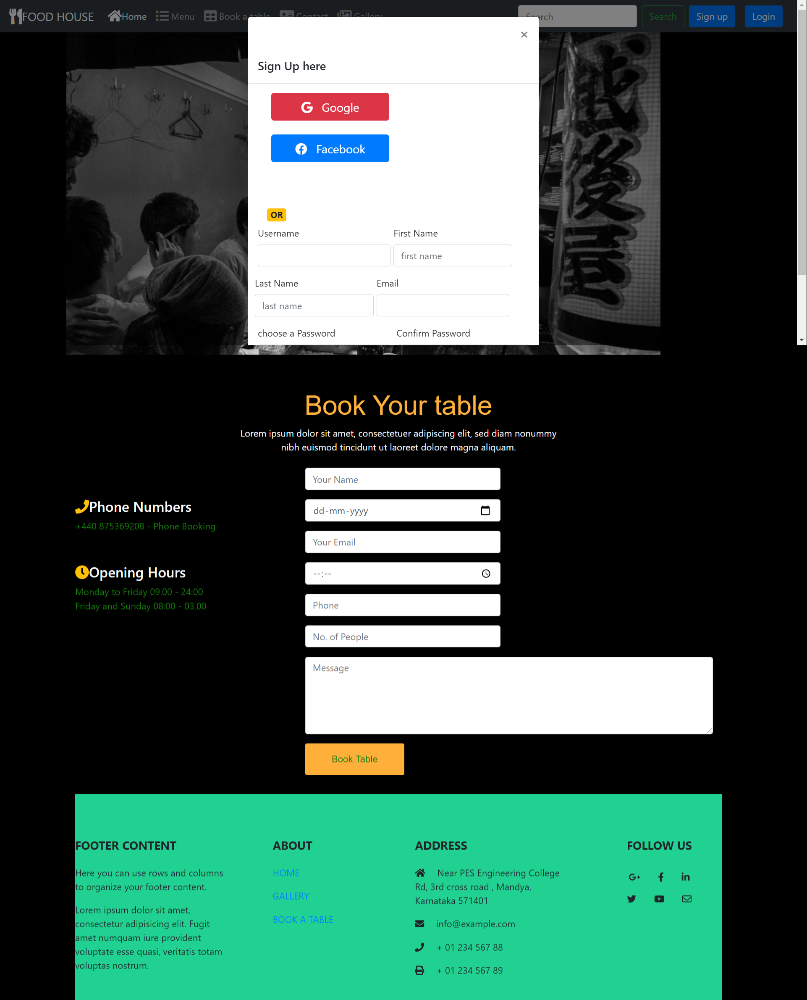
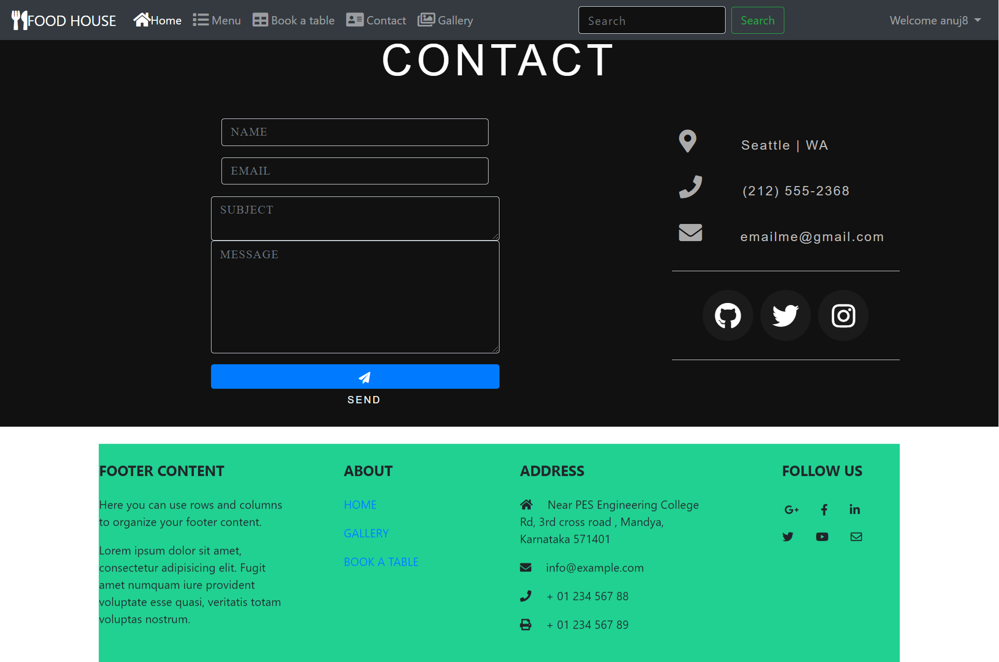
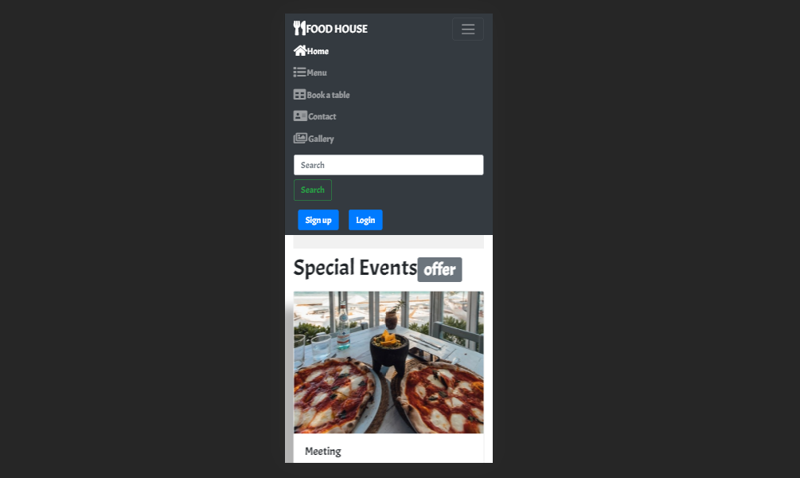

# Food house restaurant
A restaurant management system using django: http://anujmaddy.pythonanywhere.com/

Here is a real life application build with django, bootstrap-4

This application will manage Restaurant name <b>Food House </b> things automatically.

You/Your partner will be able to:
```
1. Home ;_
2.Menu :-You can view the menu of my restaurant  
3.Book a Table:- You can book Table from my restaurant  
4.Contact :-If you have any query and feedback you cant contact to restaurant owner 
5.Gallery :-You can view the images of my restaurant
6.Restriction to other people :-If you dont sign in you wont able to contact me 
7.Social account Login-You can login using google and facebook
8.And a lot..  
```

I need to have an application like this. And finally i make it. It's live now. You can test also.

Cheers!

## Tools:
```
1.Django
2.Bootstrap-4
3.Django-The message Framework
4.django-social-auth.
```
### First page  .

 
### After sucessfull Signup you can login .
  
### You can Book a table here.
  
### Contact page is restricted unless user sign in.
  
 
###  Here is mobile view .
  


## If you found this usefull don't forget to hit a star :) 
